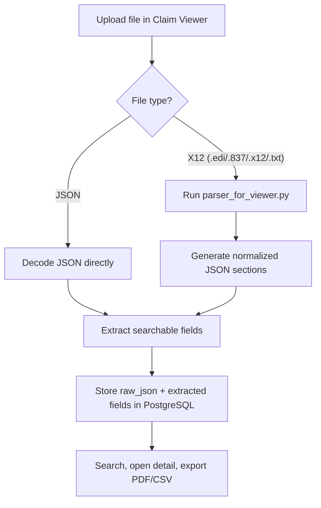

# X12 Combined: Claim Engine + Claim Viewer

I built this project as one combined workflow for healthcare claims:
- I upload a raw X12 837 file (or JSON) through the web UI.
- The app automatically converts X12 to JSON behind the scenes.
- The claim is saved to PostgreSQL.
- I can search, open, and export claims from the viewer.

This means I do not need a separate manual translation step anymore.

## What The Full System Does

The full system in `Translator-Project` combines two pieces:

1. X12 Claim Engine (Python parser)
2. Claim Viewer (Phoenix web app)

The X12 Claim Engine is embedded inside the Viewer at:

`claim_viewer/priv/python/parser_for_viewer.py`

So when I upload an X12 file from the browser, the Viewer calls this parser automatically.

## End-To-End Flow



## Where Conversion Happens

The conversion is triggered in:

`claim_viewer/lib/claim_viewer_web/controllers/page_controller.ex`

- Upload endpoint: `POST /upload`
- X12 detection by extension/content
- Python call via `System.cmd("python3", [...])`
- JSON normalization and database insert

The parser then outputs section-based JSON (the format used by the UI and DB).

## Important Clarification About Parser Dependencies

The active parser (`parser_for_viewer.py`) is a direct parser and **does not require `pyx12`**.

So for this current combined app, I only need:
- Python 3 available as `python3`
- the parser file present in `priv/python`

## Repository Layout (Relevant Parts)

```text
Translator-Project/
├── README.md
├── X12_to_JSON.md
├── Example.json
├── validate_json.py
└── claim_viewer/
    ├── README.md
    ├── config/
    ├── lib/
    │   ├── claim_viewer/claims.ex
    │   ├── claim_viewer/claim.ex
    │   └── claim_viewer_web/controllers/page_controller.ex
    └── priv/python/parser_for_viewer.py
```

## What I Can Do In The Viewer

Routes:
- `GET /` dashboard
- `GET /search` search form + results
- `GET /claims/:id` claim detail
- `POST /upload` upload JSON or X12
- `GET /claims/:id/export` PDF export
- `GET /claims/:id/export/csv` CSV export

Main features:
- Upload raw X12 directly from browser
- Automatic X12 -> JSON conversion in server flow
- Search by patient/payer/provider/claim number/date range
- View full section-by-section claim data
- Export claim as PDF/CSV

## Data Storage Model

Each claim stores:
- full payload in `raw_json`
- extracted searchable fields (patient, payer, provider, claim number, date of service)

This gives me both:
- full fidelity claim content
- fast indexed search

## Local Setup (Complete)

1. Go to the Phoenix app:

```bash
cd /Users/qiuhaozhu/Desktop/X12_Combined/Translator-Project/claim_viewer
```

2. Set DB credentials in:

`/Users/qiuhaozhu/Desktop/X12_Combined/Translator-Project/claim_viewer/config/dev.exs`

Note: this file currently has placeholders (`"xxx"`) for username/password.

3. Install deps + setup DB + build assets:

```bash
mix setup
```

4. Start server:

```bash
mix phx.server
```

5. Open:

[http://localhost:4000](http://localhost:4000)

## Runtime Requirements

- Elixir compatible with `claim_viewer/mix.exs` (`~> 1.15`)
- Erlang/OTP compatible with that Elixir version
- PostgreSQL (local dev instance)
- Python 3 (`python3` on PATH)
- Optional: `wkhtmltopdf` for PDF export

## Supported Upload Formats

- `.json`
- `.edi`
- `.837`
- `.x12`
- `.txt`

Unknown extensions are inspected by content:
- JSON-like content (`{` or `[`) -> treated as JSON
- X12-like content (`ISA*` or `ISA~`) -> treated as X12

## Notes On Included Files At Project Root

- `X12_to_JSON.md`: high-level conversion flow diagram
- `validate_json.py`: tiny JSON validation helper
- `Example.json`: sample claim-like JSON content for reference

For upload testing with the Viewer, the section-array format (like `claim_viewer/priv/static/claim.json`) is the most reliable test input.
