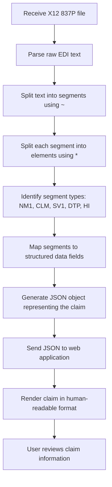

## X12 to JSON Conversion and Viewer Flow

```mermaid
flowchart TB
    A[Receive X12 837P file]
    B[Parse raw EDI text]
    C[Split text into segments using ~]
    D[Split each segment into elements using *]
    E[Identify segment types: NM1, CLM, SV1, DTP, HI]
    F[Map segments to structured data fields]
    G[Generate JSON object representing the claim]
    H[Send JSON to web application]
    I[Render claim in human-readable format]
    J[User reviews claim information]

    A --> B
    B --> C
    C --> D
    D --> E
    E --> F
    F --> G
    G --> H
    H --> I
    I --> J
```
